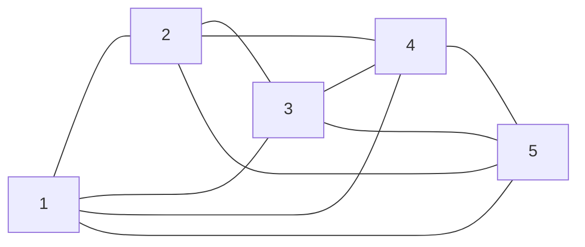

# W5 - Dynamic Programming Pt.1

##  Shortest path as network flow

Given undirected graph $G = (V, E)$, start node $s$, and end node $t$, we want to find the shortest path $s\leadsto t$. 

- Each edge $ij\in E$ has a ***non-negative*** cost $c_{ij}$. Typically the distance.
- The $\leadsto$ arrow means the path from $s$ to $t$, including arbitrarily many intermediate vertices.

#### Decision Variables

We want to find which edge to take from $E$. 

$$
x_{ij} = \begin{cases}
1 & \text{if $ij$ is in the shortest path}\\
0 &\text{otherwise}

\end{cases}
$$

#### Objective

Minimize the path cost.

$$
\begin{aligned}
\min&&&\sum_{ij\in E} c_{ij}x_{ij}\\
\text{subject to }&&&\left\{\begin{gathered}\forall v\in V,\\
\text{Flow out $-$ Flow in} = \begin{cases}
0 & \text{if } v\ne s, t\\
-1 & \text{if }v=s\\
1 & \text{if }v = t
\end{cases}

\end{gathered}\right.
\end{aligned}

$$

We could solve the shortest path problem with a general LP solver, but we have more efficient algorithms.

### Dijkstra’s Algorithm

The following pseudocode is from my own [algorithm notes](https://www.notion.so/Single-Source-Shortest-Paths-ccab559c3b5c4f018913429bf3b1091c?pvs=21) but it does the same thing as what we did in class.

|||:icon-code: Pseudocode
```c
function Initialize(G, start):
	for each vertex v in G:
		dist[v] = Infinity
		pred[v] = nothing
	dist[start] = 0
	pred[start] = nothing
	return dist, pred

function NonNegativeDijkstras(G, start):
	dist, pred = Initialize(G, start)
	dist[start] = 0
	
	queue = PriorityQueue()
	for each vertex v in G:
		put v in queue with priority dist[v]

	while queue is not empty:
		u = queue.ExtractMin()
		for each adjacent vertex v:
			if dist[v] > dist[u] + weight(uv):
				dist[v] = dist[u] + weight(uv)
				pred[v] = u
				queue.UpdatePriority(v, dist[v])
```
|||:icon-rocket: Complexity
```
// matched to each line


O(V)


O(V log V)


O(E) with inner for loop
O(log V) for heaps
already counted


O(log V) for heaps
```
|||

where `queue.ExtractMin()` grabs the vertex with the shortest distance.

=== **Ex.** In-class practice graph

{ class="image-m" }

Running Dijkstra’s algorithm with $\text{start} = A$ gives us shortest path from $A$ to every other node:

```
==> Selected start: A
╭──────────────┬────────────────────────────────┬────────────╮
│ End Vertex   │ path                           │   distance │
├──────────────┼────────────────────────────────┼────────────┤
│ A            │ []                             │          0 │
│ B            │ ['A', 'B']                     │         10 │
│ C            │ ['A', 'B', 'C']                │         39 │
│ D            │ ['A', 'E', 'F', 'G', 'D']      │         48 │
│ E            │ ['A', 'E']                     │          8 │
│ F            │ ['A', 'E', 'F']                │         22 │
│ G            │ ['A', 'E', 'F', 'G']           │         34 │
│ H            │ ['A', 'E', 'F', 'G', 'H']      │         53 │
│ I            │ ['A', 'E', 'I']                │         20 │
│ J            │ ['A', 'E', 'F', 'J']           │         37 │
│ K            │ ['A', 'E', 'F', 'G', 'K']      │         43 │
│ L            │ ['A', 'E', 'F', 'G', 'K', 'L'] │         61 │  <== Path from A to L
╰──────────────┴────────────────────────────────┴────────────╯
```
===


### Optimal Substructure

Suppose $s\leadsto t$ is the shortest path from $s$ to $t$, and $v$ is an intermediate node.

Then the sub-path $s\leadsto v$ and $v\leadsto t$ are both shortest paths from $s$ to $v$, $v$ to $t$ respectively.

##  Asymmetric Traveling Salesman Problem

For a directed graph $G = ( V, A)$, a non-negative cost $c_{ij}$ for each arc $i\to j$, we want to find the shortest tour (visit all nodes exactly once and return to the starting node)

#### Decision Variable

$$
x_{ij} = \begin{cases}
1 & \text{if $i\to j$ is in the final tour}\\
0 &\text{otherwise}
\end{cases}
$$

#### Objective

Minimize the total cost.

$$
\min\sum _{i \to j \in A}c_{ij}x_{ij}
$$

### Constraints

For each $v\in  V$, let the set of edges entering $v$ be $\delta^-$, edges leaving $v$ be $\delta ^+$:

$$
\delta^- (v) = \{i\to v\in A\}\\
\delta^+ (v) = \{v\to i\in A\}
$$

We should pass through $v$ exactly once, so 1 edge in 1 edge out.

$$
\begin{aligned}
\sum_{a\in \delta^-(v)}x_{a} &= 1\\
\sum_{a\in \delta^+(v)}x_{a} &= 1\\
\end{aligned}
$$

#### Sub-tour elimination

The graph should also be connected, no isolated subgraphs

](Untitled%201.png)

We don’t want (1) basically, since there’s complete tour. [Source](https://www.mdpi.com/2075-1680/10/1/19)

#### The Dantzig-Fulkerson-Johnson (DFJ) formulation

$$
\forall S\sub V, S\ne \varnothing,\text{ define }\delta ^+(S) =\{i\to j\in A:i\in S, j\notin S\}\\[10pt]
\sum_{a\in \delta^+(S)}x_a\geqslant 1
$$

This constraint is what makes TSP an NP-Hard problem, the number of possible $S$’s is the size of the power set of $V$, which is ${\cal P}(V)=2^{V}$

#### The Miller–Tucker–Zemlin (MTZ) formulation

For each node $i\in V$, label with $u_i\in\N$ except the starting node.

$$
\begin{cases}u_j > u_i &\text{if } x_{ij} = 1\\
\text{no constraints} & \text{if } x_{ij} = 0

\end{cases}
$$

The idea is we must go to a node that has a larger label than the current node. 

{class="image-m"}


This prevents us from going into cycles, since if we do, we will eventually travel to a node with a smaller label, which violates the constraint.

##  Symmetric TSP

Now we consider a undirected graph $G = (V, E)$, a non-negative cost $c_{ij}$ for each edge $i j$. We also know that $c_{ij} = c_{ji}$.

#### Objective

Same as the asymmetric case.

$$
\min\sum _{e \in E}c_{e}x_{e}
$$

#### Constraints

Let $\delta (v)$ be the set of edges connected to node $v$:

$$
\delta (v)=\{iv\in E\}
$$

The one edge in, one edge out constraint is:

$$
\forall v\in V, \sum_{e\in\delta (v)}x_e = 2
$$

Let $\delta(S), S\sub V$ be the set of edges that have one node in $S$ and one node not in $S$:

$$
\delta (S) = \{ij:i\in S, j\notin S\}
$$

Using the DFJ formulation for sub-tour elimination, we have:

$$
\forall S\sub V, S\ne\varnothing\\\sum_{e\in\delta (S)}x_e\geqslant 2
$$

##  Dynamic Programming (DP)

### General formulation

Every DP problem has the following properties:


Stages
:	$t=1,2,\dots ,T$  

State at stage $t$
:	$s_t$  

Value function 
:	$v_t(s_t)$  

Transition cost 
:	$c(s_{t-1}, s_t)$  

$$
v_t(s_t) = \min/\max\{v_{t-1}(s_{t-1}) + c(s_{t-1}, s_t)\}
$$

!!!success Theorem. Principle of optimality

If $v_t(s_t)$ is optimal, then all the subproblems $v_{t-1}(s_{t-1})$ are also optimal.
!!!

### 0-1 Knapsack

Given a backpack with capacity $b$, and $n$ items where each item takes up capacity $a_i$ and is worth $c_i$ dollars. Decide which items to take.

#### Objective

Let $x_i$ be the indicator variable of whether to take item $i$, we want to maximize total profit:

$$
\begin{aligned}
\max&&&\sum^n_{i=1}x_ic_i\\
\text{subject to} &&& \left\{\begin{aligned}
\sum^n_{i=1}x_ia_i & <b\\
x_i & \in\{0,1\}

\end{aligned}\right.

\end{aligned}
$$

If we don’t have the integer constraint $x_i\in\{0,1\}$, we can just take the items with maximum profit-to-capacity ratio: $\frac{c_i}{a_i}$.

#### DP Formulation

Stage  
:	The maximum item index $1, 2,\dots,n$. If we are in stage $k$, we only consider items $1,2,\dots, k$. 

State  
:	$w$, remaining capacity of the backpack 

Value function
:	$v_k(w)$, max profit given capacity $w$ and items $1,2,\dots k$ 

$$
v_k(w) = \max\left\{\begin{gathered}v_{k-1}(w-a_k) + c_k\\v_{k-1}(w)\end{gathered}\right\}
$$

We can try to take item $k$ if it fits, or we can skip $k$.

### Bounded Knapsack

Now suppose each items has a maximum of $u_i$ copies.

$$
0\leqslant x_i\leqslant u_i
$$

In this case we include the number of copies as part of the state, $v_k(w, s_k)$ now represents the maximum profit with capacity $w$, $s_k$ copies of item $k$, and using item $1\dots k$.

$$
v_k(w, s_k) = \max_{0\leqslant s_k\leqslant u_k}\{v_{k-1}(w-s_ka_k) + s_kc_k\}
$$

### Direct TSP with dynamic programming

Consider the graph $G=(V,A)$



$$
\begin{array}{c|ccccc}
i\backslash j & 1 & 2 & 3 & 4 & 5\\
\hline
1 & 0 & 3 & 1 & 5 & 4\\
2 & 1 & 0 & 5 & 4 & 3\\ 
3 & 5 & 4 & 0 & 2 & 1\\
4 & 3 & 1 & 3 & 0 & 3\\
5 & 5 & 2 & 4 & 1 & 0
\end{array}
$$

The subproblem is a graph with the sam vertices, but less edges.