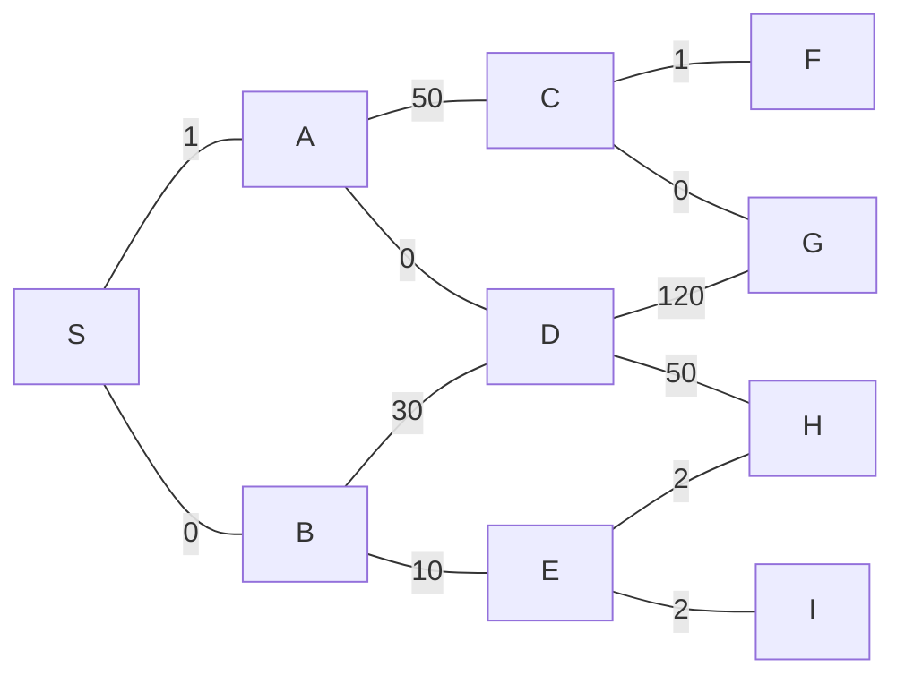

# W6 - Dynamic Programming Pt.2

## Lot Sizing / Generalized Inventory Problem

#### Scenario. Keeping inventory

Go back to the coffee shop example: A coffee shop needs to decide how much coffee beans to purchase and how frequently should they purchase. Now suppose we also own a roastery with a bunch of roasters, where we can roast our own coffee beans.

#### Inputs

| $t$ | Time period |
| --- | --- |
| $d_t$ | Demand at time $t$ |
| $s_t$ | Inventory at the start of period $t$ |
| $a_t$ | Production amount at period $t$ |
| $b$ | Unit production cost |
| $h$ | Unit holding cost |
| $K$ | Fixed cost for starting production |
| $c(a_t)$ | Production cost function |

$$
c(a_t) = \begin{cases}
0 & \text{if }a_t = 0\\
K + b\cdot a_t & \text{if }a_t > 0
\end{cases}
$$

Note that “period” is the interval between each timestamp

#### Stage, State, Value Function

| Stage | Time $t = 1, 2\dots, T$ |
| --- | --- |
| State | Inventory $s_t$ |
| Value function | $v_t(s_t)$,  the minimum cost from time $t$ to $T$ with initial inventory $s_t$ |
| Action | $a_t$, the production amount |

The optimality equation is:

$$
v_t(s_t) =\min_{a_t}\{c(a_t) + h\cdot(s_t + a_t - d_t) + v_{t+1}(s_t + a_t - d_t)\}
$$

with base cases:

$$
v_{T+1}(s_{T+1}) = 0, \forall s_{T+1}
$$

#### Bounds

Suppose we only have $M$ machines, then $a_t$ is bounded by the number of machines

$$
a_t\in\{0,1,\dots , M\}
$$

The inventory capacity could be capped at $D$, this bounds the state:

$$
s_t\in\{0,1,\dots, D\}
$$

### Properties of the Inventory Problem

Assuming unit costs $b, h$ are independent of time $t$, we have:

#### Prop. Don’t produce if we have inventory

$$
a_t > 0\implies s_t = 0
$$

If it is optimal to produce during any time period $t$, then the starting inventory is 0

#### Prop. If we produce, produce enough to cover integer amount of time periods

If it is optimal to produce in stage $t$ (so $a_t > 0$ for some $t$), then it is optimal to produce an amount that exactly covers the demand for $t, t+1, \cdots, t+j$ for some  $0\leqslant j\leqslant T-t$.

#### Prop. Equivalent optimality equation

Using the previous 2 properties, we only need to find the number of time periods $j$ to cover when we produce. If we produce enough to cover $j$ periods, we move to time $t+j+1$.

$$
v_t = \min_{0\leqslant\, j\leqslant\, T-t}\{c_{t,t+j+1} + v_{t+j+1}\}
$$

where the transition cost $c_{t, t+j+1}$ is:

$$
c_{t,\,t+j+1} = K + h\sum^j_{i=1}\underbrace{i\cdot d_{t+i}}_{\substack{\text{need to keep the demand}\\\text{ amount in inventory}}}
$$

with base cases $v_{T+1} = 0, s_1 = 0$.

## Stochastic Dynamic Programming

### Markov Chain Review

#### Def. Discrete Time Markov Chain

[!badge Definition]

A discrete, time homogeneous Markov chain on state space $S$ with transition matrix $P$ and initial distribution $\alpha$ is a sequence of random states $X_n\in S$ such that:

1. $\Bbb P(X_0 = i) = \alpha_i$
2. **Prop.** Markov Property
    
    
    $$
    \Bbb P(X_{t}= j\mid X_{t-1} = i) = \Bbb P(X_{t} = j\mid X_{t-1} = i, X_{t-2 } = i_{t-1}\dots)
    $$
    

The elements $p_{ij}$ in $P$ represents:

$$
p_{ij} = \Bbb P(X_{t+1} = j\mid X_t = i)
$$

#### Prop. $n$ step transition probability

It’s the $i,j$ th entry in $P^n$.

$$
\begin{aligned}
\Bbb P(X_n = j\mid X_0 = i) &= \Bbb P(X_{m+n}= j\mid X_m = i) \\&= P^n_{ij}
\end{aligned}
$$

#### Def. Communicate

2 states $i, j\in S$ communicates if they are accessible from each other.

$$
i\lrarr j \coloneqq i\to j\text{ and }j \to i
$$

#### Def. Closed Subset

A subset of state space $T\sub S$ is closed if any of the states in $T$ is ever entered, the chain cannot leave $T$. In terms of transition probability:

$$
P_{ij} =0\hskip1em\forall i\in T, j\notin T
$$

The entire state space is always closed.

### Markov decision process with finite time

For this class we assume time $t$ is finite, $t = 0,1,2,\dots, N$.

#### Variables

| $s_t\in S$ | State at time $t$ |
| --- | --- |
| $a_t\in A$ | Action at time $t$ |
| $r_t(s_t, a_t)$ | Reward function for the state, action pair at time $t$ |
| $\Bbb P(s_{t+1}\mid s_t, a_t)$ | Transition probability of going to state $s_{t+1}$ given we took action $a_t$ at state $s_t$. |
| $R(s_N)$ | Reward if we end on state $s_N$ |

#### Optimality Equation

Starting with the deterministic case, we want to see with action at time $t$ maximizes / minimizes the reward.

$$
v_t(s_t) = \underset{a_t\in A}{\max/\min}\,\{r_t(s_t, a_t) + v_{t+1}(s_{t+1})\}
$$

For the stochastic case, replace $v_{t+1}$ with expected value, since it’s possible we might not get to the state $s_{t+1}$. The next state became a random variable:

$$
v_t(s_t) = \underset{a_t\in A}{\max/\min}\,\Big\{r_t(s_t, a_t) + {\color{darkorange}\Bbb E}[v_{t+1}(s_{t+1})\mid s_t, a_t]\Big\}
$$

Expand with the definition of $\Bbb E$:

$$
v_t(s_t) = \underset{a_t\in A}{\max/\min}\,\left\{r_t(s_t, a_t) + \sum_{s_{t+1}\in S}{\Bbb P}(s_{t+1}\mid s_t, a_t)\cdot v_{t+1}(s_{t+1})\right\}
$$

with base cases $v_N(s_N) = R(s_N)$ for some final reward function $R$ and each possible end state $s_N\in S$.

#### Decision Rule $\small d_t$

At each state $s_t$, we want to pick out an action $a_t$. There are 2 types of decision rules.

**Markovian** $d_t(s_t)$ returns an action by looking at current state.

**History dependent** $d_t(s_1,a_1\dots s_{t-1}, a_{t-1}, s_t)$ returns an action by looking at all past states and actions.

#### Def. Policy $\pi$, sample path $\omega$, total reward $W$

The decision rules at each stage

$$
\pi = (d_1, d_2, \dots d_{N-1})
$$

Given a policy $\pi$, we automatically get a sample path $\omega$,

$$
\omega= (s_1, a_1, s_2, a_2,\dots,s_{N-1}, a_{N-1}, s_N)
$$

The probability of the path happening is:

$$
\Bbb P(\text{path} = \omega) \\= \Bbb P(X_1 = s_1)\cdot\Bbb P(X_2 = s_2\mid s_1, a_1)\cdots\Bbb P(X_N = s_N\mid s_{N-1, a_{N-1}})
$$

A sample path also has a total reward $W$,

$$
W(\omega) = R
(s_N)+\sum_{i=1}^{N-1}r_i(s_i, a_i) 
$$

Each $s_i$ in the sum is a random variable, so the expected total reward is:

$$
\Bbb E_{W,\pi}[W(\omega)] = \sum_{\text{all possible }\omega} \Bbb P(\text{path}=\omega) \cdot W(\omega)
$$

#### Ex.1 Stochastic Shortest Paths

Let each layer of the graph be the state at $t=0, t=1, t=2, t=3$.

At each stage, we can choose to go up or down. Since it’s stochastic, there’s a transition probability. Define:

$$
\begin{aligned}
\Bbb P(\text{actually go up}\mid \text{choose to go up}) &= p_u\\
\Bbb P(\text{actually go down}\mid \text{choose to go down}) &= p_d\\
\Bbb P(\text{actually go down}\mid \text{choose to go up}) &= 1-p_u\\
\Bbb P(\text{actually go up}\mid \text{choose to go down}) &= 1-p_d\\

\end{aligned}
$$

For the path $\omega = \text{SACF}$, the probablity is $\Bbb P(\text{path} = \omega) = p_u^3$ because we need to actually go up 3 times.

There are $2^3$ possible sample paths (2 choice at each stage, 3 stages in total). Each path $\omega_i$ has a reward $W(\omega_i)$ and a probability $\Bbb P(\omega_i)$.

So the expected reward is:

$$
\Bbb E_{W\!,\pi}[W(\omega)] = \sum_{i=1}^{2^3}W(w_i)\cdot \Bbb P(\text{path} = \omega_i)
$$

## Policy Backward Evaluation